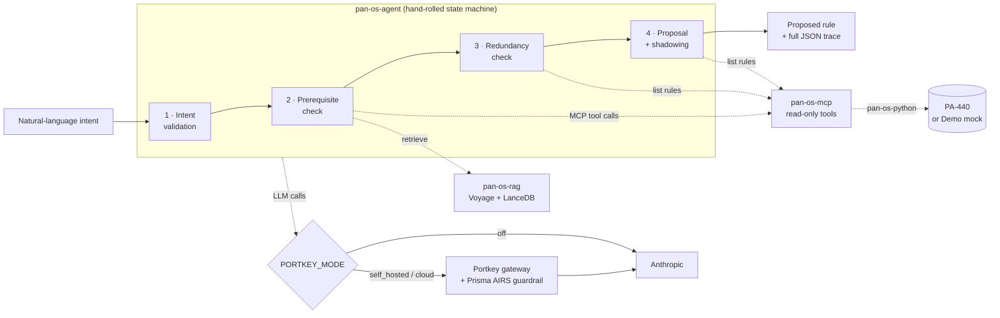

# pan-os-policy-agent

Turn a plain-English security-policy request — *"the finance group needs access
to Salesforce"* — into a proposed PAN-OS Security rule, validated through a
four-stage gauntlet against a **live firewall** and **PAN-OS documentation**.
The agent proposes and explains; it has a deliberate simulated approval gate and
**never commits to the firewall** (v1). Model calls can optionally route through
the [Portkey](https://portkey.ai) AI gateway with **Prisma AIRS** as an inline
guardrail — both off by default, enabled by configuration.

It runs with **zero infrastructure** in Demo mode: a canned firewall and doc set
let a Sales Engineer drive the whole gauntlet from a laptop with no PA-440 and no
Voyage key.

## Architecture



Each stage transforms one append-only `PolicyDraftState`; the loop halts at the
first stage that stops. Every run *is* its own JSON-serializable trace.

## The four-stage gauntlet

1. **Intent validation** — parse the request into structured PAN-OS terms
   (zones, source/destination, user, application, service, action) and judge
   coherence. Halts if it isn't an access-control request.
2. **Prerequisite check** — gather firewall inventory over MCP (zones, address
   objects/groups, services) and retrieve relevant docs via RAG, then flag
   missing objects and missing configuration prerequisites (e.g. User-ID for
   group-based rules), each grounded in a retrieved doc chunk.
3. **Redundancy check** — read the rulebase in evaluation order and judge whether
   an existing rule already satisfies the intent. Halts if so.
4. **Proposal + shadowing** — generate the rule (filling `any` /
   `application-default` defaults) and flag whether an earlier, broader rule
   would shadow it. This is the terminal output for the simulated approval gate.

## Packages

A `uv` workspace with three library packages (`pan-os-*` PyPI names, `pan_os_*`
import names):

- **`pan-os-mcp`** — a FastMCP server exposing read-only tools over the firewall
  (`get_system_info`, `list_zones`, `list_address_objects`,
  `list_address_groups`, `list_services`, `list_security_rules`). Serves over
  stdio (default) or streamable-HTTP. Read-only by construction.
- **`pan-os-rag`** — retrieval over PAN-OS 11.1 TechDocs (Policy + Policy Objects
  + User-ID). Voyage embeddings + LanceDB with a rerank pass; a hand-labeled eval
  set measures retrieval quality (recall@5).
- **`pan-os-agent`** — the agent: a real MCP *client*, a hand-rolled async state
  machine, the four stages, a single LLM/MCP client factory (`llm_client.py`), a
  single-shot CLI, and the Streamlit demo app.

## Requirements

- **Python 3.11** (pinned `>=3.11,<3.12` — `pan-os-python` imports `distutils`)
- **[uv](https://docs.astral.sh/uv/)** for the workspace and runs
- **Anthropic** API key (always). For live (non-Demo) mode: a reachable **PAN-OS
  firewall** with a read-only API role, and a **Voyage AI** key for RAG.

## Setup

```bash
git clone https://github.com/edoscars/pan-os-policy-agent
cd pan-os-policy-agent
uv sync                 # installs all three workspace packages
cp .env.example .env    # optional — every value is also editable live in the UI
```

## Quickstart

```bash
uv run --group demo streamlit run packages/pan-os-agent/app.py
```

Opens at `http://localhost:8501`. Leave **Demo mode** on, enter your Anthropic
key in the sidebar (or pre-fill it from `.env`), pick an example, and click **Run
gauntlet**. No firewall, no Voyage key, no config files required. Switch Demo
mode off in the sidebar to point at a real firewall.

### CLI (live mode)

```bash
# build the RAG store once (live mode only; Demo mode uses a canned retriever)
uv run --env-file .env python packages/pan-os-rag/scripts/build_embeddings.py
uv run --env-file .env python packages/pan-os-rag/scripts/build_store.py

# run one intent
uv run --env-file .env python packages/pan-os-agent/scripts/run_agent.py \
    "finance group needs access to Salesforce"

# run a fixtures file, dumping full JSON traces to ./traces
uv run --env-file .env python packages/pan-os-agent/scripts/run_agent.py \
    --fixtures packages/pan-os-agent/fixtures/intents.txt --out traces
```

Every run ends in one of three outcomes: **halted at intent** (not an
access-control request), **halted at redundancy** (an existing rule already
covers it), or a **proposed rule** with any unmet-prerequisite and shadowing
caveats.

## Configuration

All configuration is environment variables (see `.env.example`), and every field
is also editable live in the UI sidebar for the session (held in memory only —
never written to disk or logged).

| Variable | Purpose |
|---|---|
| `ANTHROPIC_API_KEY` | Anthropic key. Required unless using Portkey Cloud with a virtual key. |
| `MODEL` | Anthropic model id for direct / self-hosted calls (default `claude-opus-4-8`). |
| `PORTKEY_MODE` | `off` (direct Anthropic, default), `self_hosted`, or `cloud`. |
| `PORTKEY_API_KEY` | Portkey key (self_hosted / cloud). |
| `PORTKEY_CONFIG` | Portkey Config ID (`pc-***`) whose guardrails run Prisma AIRS. |
| `PORTKEY_MODEL` | Cloud only: model catalog slug (`@anthropic/…`). |
| `PORTKEY_VIRTUAL_KEY` | Cloud only: vault-backed provider credential (optional). |
| `PORTKEY_SELF_HOSTED_URL` | self_hosted only: local gateway URL (default `http://localhost:8787/v1`). |
| `PORTKEY_MCP_URL` | Optional: route MCP tool calls through the Portkey MCP gateway. |
| `PANOS_HOST` / `PANOS_API_KEY` / `PANOS_VSYS` | Firewall connection (live mode). |
| `VOYAGE_API_KEY` | RAG embeddings + rerank (live mode). |

### Prisma AIRS + Portkey

With `PORTKEY_MODE=self_hosted` or `cloud` and a `PORTKEY_CONFIG` whose Config
carries a **Prisma AIRS** input/output guardrail, every prompt is scanned before
the model and every response after. A violation is denied at the gateway (HTTP
446) and the run halts as a security event, surfaced as a badge in the UI. AIRS
is configured **entirely in the Portkey GUI** — there is no AIRS code or key in
this repo. On the default `off` (Direct Anthropic) path there is no gateway, so
no scanning; the UI states this plainly. See
[docs/integration-guide.md](docs/integration-guide.md).

## Testing & quality

```bash
uv run pytest          # offline, deterministic (firewall, RAG, LLM all faked)
uv run ruff check .
uv run mypy packages/pan-os-mcp/src packages/pan-os-rag/src packages/pan-os-agent/src
```

## Evaluation

- **Retrieval** (`pan-os-rag/eval`) — recall@5 over 30 hand-labeled questions.
- **End-task grounding** (`pan-os-agent/eval`) — runs the full gauntlet over
  labeled intents and scores the *product* (outcome, proposed-rule fields,
  flagged prerequisites/shadowing), not a retrieval proxy.

## v1 scope vs. v2

**v1 (this build)** is read-only with a simulated approval gate: it proposes and
explains but never writes to the firewall — every MCP tool is read-only by
construction. Single firewall, Security rulebase only, no Panorama.

**Deferred to v2:** real commit capability (a candidate-config write path — where
Prisma AIRS would guard the outbound change), Panorama and device groups,
non-Security rulebases, OAuth on the MCP server, and cloud deployment.

## Docs & credits

- [docs/architecture.md](docs/architecture.md) — design rationale (why MCP, why
  RAG, hand-rolled vs. LangGraph, why Portkey/AIRS are optional-by-default).
- [docs/sales-engineering-demo-guide.md](docs/sales-engineering-demo-guide.md) —
  a runbook + talk track for demoing this cold.
- [docs/integration-guide.md](docs/integration-guide.md) — the AIRS-at-the-gateway
  slide narrative.

Built by [@edoscars](https://github.com/edoscars). Uses PAN-OS, pan-os-python,
Anthropic Claude, Voyage AI, LanceDB, FastMCP, Portkey, and Prisma AIRS.
